# Kindle Drone Tools

**Passive Wi-Fi drone detection system for jailbroken Amazon Kindle 4**

Detects DJI, Parrot, Autel, and other drone models using Wi-Fi signal analysis on the built-in Atheros AR6003 chipset. Displays real-time detection HUD, threat scores, and RF activity on the device's e-ink display.

## Features

✅ **Real-time Wi-Fi AP scanning** (5-second cycle)  
✅ **Threat scoring system** (0–100 scale, ML-ready)  
✅ **Distance estimation** (log-distance path loss model)  
✅ **Temporal analysis** (movement detection, channel hopping, transient tracking)  
✅ **CRC-based external RF detection** (2.4 GHz interference indicator)  
✅ **E-ink HUD display** (50×40 ASCII text, radar images, weather/sensor pages)  
✅ **Hardware sensor integration** (battery %, room temperature)  
✅ **Persistent CSV logging** (14-column detection history)  
✅ **Power bank keepalive** (automatic charging throttle to prevent auto-shutoff)  

<details>
<summary><strong>🖼️ Quick Visual Preview</strong></summary>

**E-Ink Display Pages:**
| Welcome | Weather | Radar | Temperature |
|---|---|---|---|
| 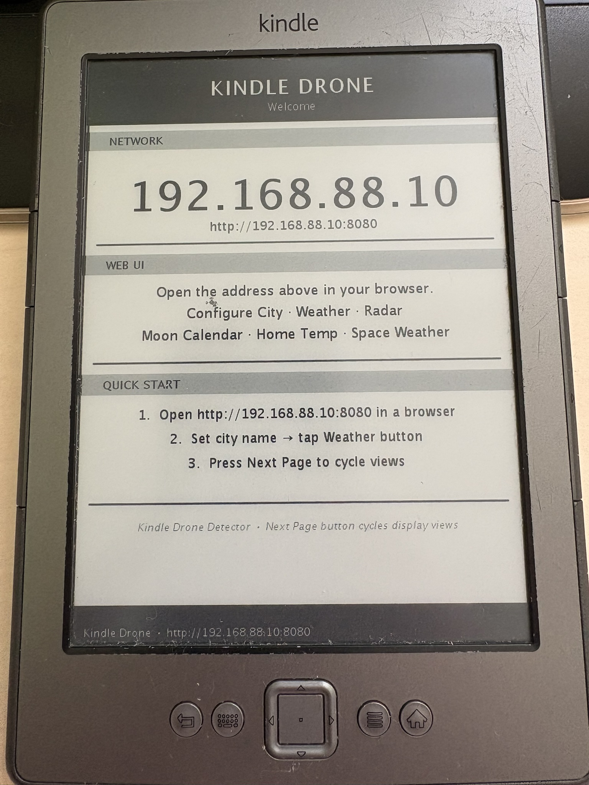 | 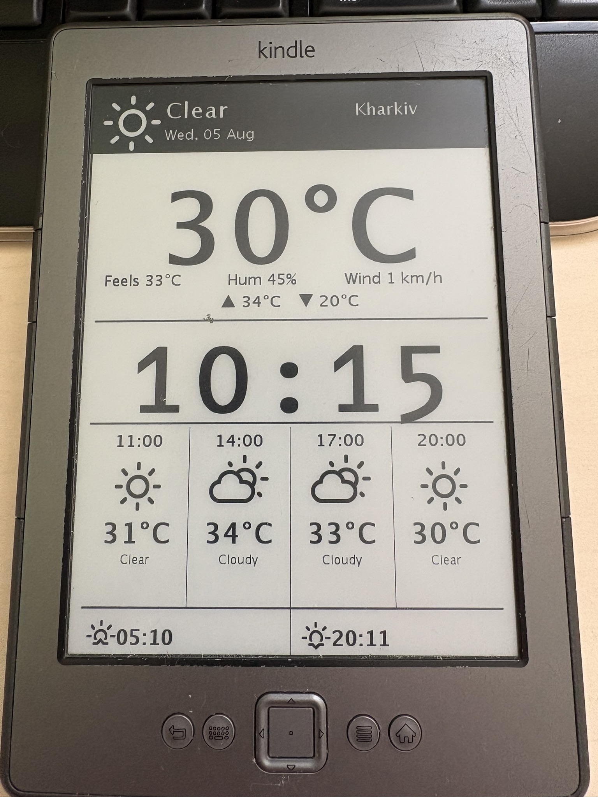 | 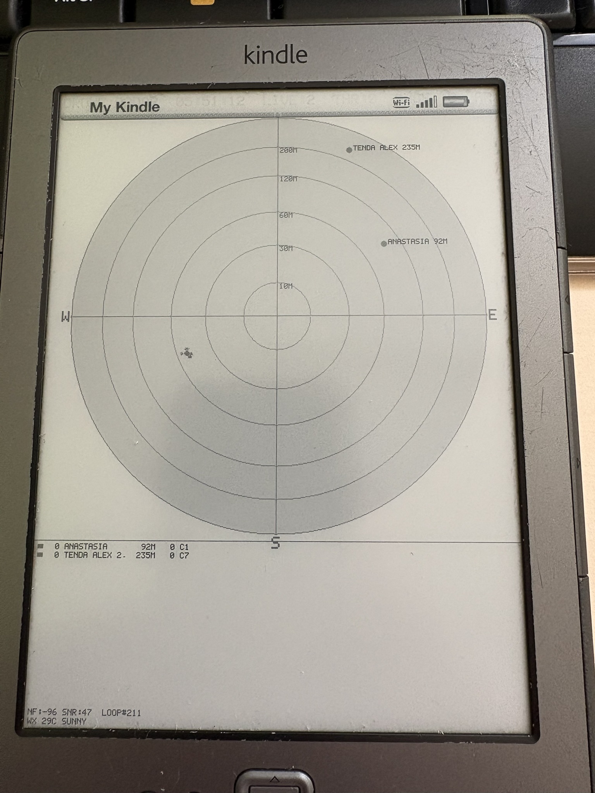 | 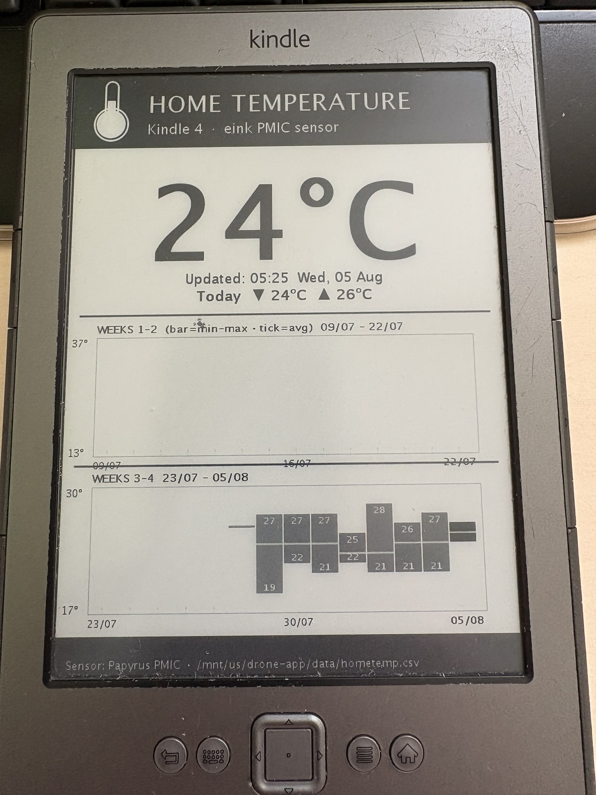 |

</details>

---

## Hardware Requirements

| Item | Details |
|---|---|
| **Device** | Amazon Kindle 4 (2011 model, 600×800 e-ink) |
| **Jailbreak** | SSH enabled on `/mnt/us/` mounted partition |
| **Chipset** | Atheros AR6003 hw2.1.1 (built-in, no USB WiFi adapter needed) |
| **CPU** | ARM, 256 MB RAM minimum |
| **WiFi** | Passive scanning (no monitor mode required) |

---

## Quick Start

### 1. Build

```bash
# On development machine
mvn -DskipTests clean package
# Output: drone-app/target/drone-app-2.0.0-SNAPSHOT.jar
```

### 2. Deploy to Kindle

```bash
# Upload JAR and runtime scripts
scp drone-app/target/drone-app-2.0.0-SNAPSHOT.jar root@<kindle-ip>:/mnt/us/
scp scripts/kindle/drone-*.sh root@<kindle-ip>:/mnt/us/
ssh root@<kindle-ip> "chmod +x /mnt/us/drone-*.sh"
```

### 3. Start on Kindle

```bash
# Start detector
ssh root@<kindle-ip> "/mnt/us/drone-control.sh start"

# View status
ssh root@<kindle-ip> "/mnt/us/drone-control.sh status"

# Stream logs
ssh root@<kindle-ip> "tail -f /mnt/us/drone-app.log"

# Stop detector
ssh root@<kindle-ip> "/mnt/us/drone-control.sh stop"
```

---

## Logging & Monitoring

### Detection Log
- **Path:** `/mnt/us/drone-app.log`
- **Format:** Tab-separated fields (timestamp, MAC, SSID, distance, threat, flags)
- **Update:** Every 5 seconds
- **Retention:** Auto-trimmed at 10 MB

### CSV History
- **Path:** `/mnt/us/drone_nets.csv`
- **Columns:** mac, ssid, firstSeen, lastSeen, count, peakSignal, oui, keyword, obsTime, distHist, lastCh, surgeCnt, maxApp, lastFlags
- **Purpose:** Persistent baseline and anomaly tracking

### Real-time Status
```bash
ssh root@<kindle-ip> "cat /mnt/us/drone-app.log | tail -20"
```

---

## E-Ink Display

### Screen Layout
```
DRONE 02:48:34 AP:30 THR:2 #45
CRC+52 NF:-96 SNR:33 LQ:42 ARMED
--------------------------------------
!~* 7m  -53dB C6  DJI_MAVIC_3      DJI NEW STR
+   43m -74dB C3  [HIDDEN]         HID RMAC
    65m -79dB C9  HomeNetwork
    71m -80dB C6  Buffonn
```

### Display Modes (auto-rotating every 5 minutes)
1. **Main HUD** — Top 30 APs by threat score (`weather`)
2. **Moon Information** — Lunar phase and calendar (`moon`)
3. **Space Weather** — Solar & geomagnetic activity (`space`)
4. **Home Temperature** — Room temperature history (`hometemp`)
5. **Date & Time Transition** — Big-font local time (HH:MM), day of week, and daily funny quote (`time`)
6. **Radar** — Graphical AP position map (`radar`, 30-second hold)

> **Note on Date & Time Display (`time` view):**
> Rendered using low-power, text-only native Kindle `eips` commands (no Java AWT, no PNG rendering, zero flash wear).
> - **Animated Reveal:** Renders row-by-row top-to-bottom with a 60 ms per-row delay for a retro CRT scanline reveal (~2.4s total animation), then holds static for the remaining duration.
> - **System Time Sync:** Automatically syncs Java's timezone at startup against the Linux system time (`date +%H` vs UTC) to guarantee accurate DST-aware local time display (e.g. `16:27 EEST`).

### Symbols
| Symbol | Meaning |
|---|---|
| `!` | Threat ≥60 (likely drone) |
| `+` | Threat ≥30 (suspicious) |
| `~` | Moving (signal variance >10 dB) |
| `*` | New device, not in baseline |
| `ARMED` | Baseline complete, alerting active |
| `LEARN` | Still building baseline (first 30 loops) |
| `** RF BURST **` | CRC delta >200 (non-WiFi 2.4 GHz) |
| `** EXT RF **` | Idle CRC detected external RF |

<details>
<summary><strong>📸 Display Screenshots (9 pages)</strong></summary>

### Display Screenshots

#### Welcome Page (App Startup)


#### Weather Page


#### Moon Information Page
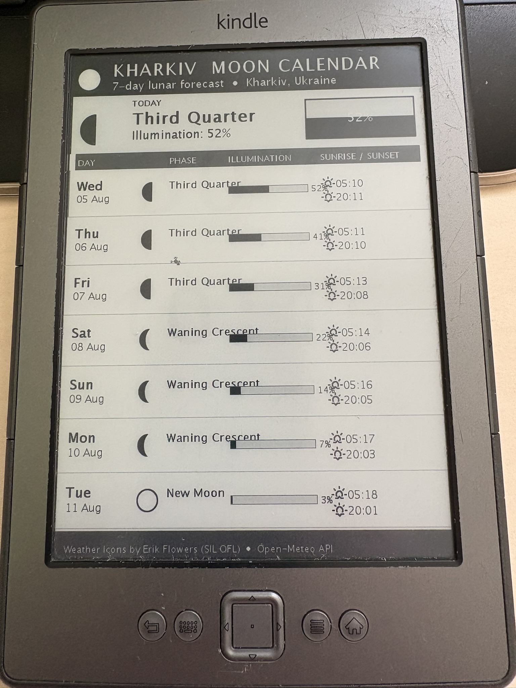

#### Space & Weather Page
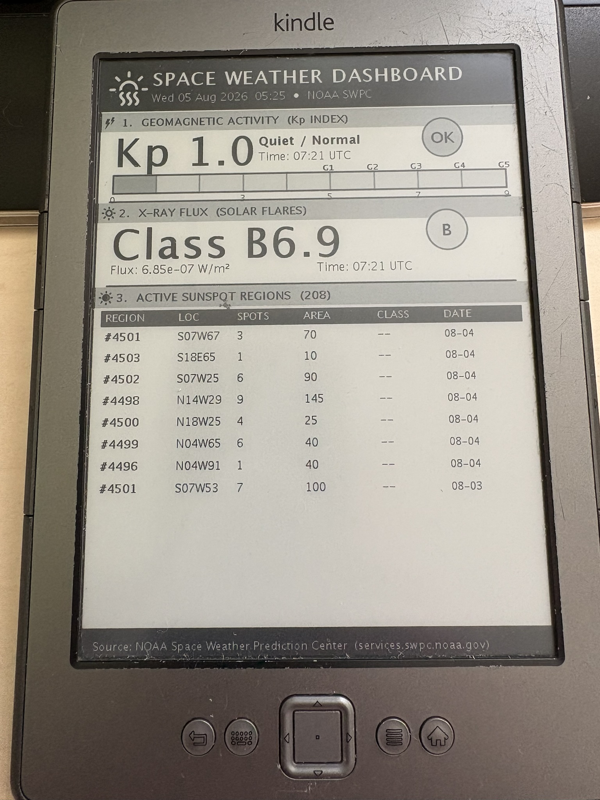

#### Home Temperature History


#### Date & Time Transition View
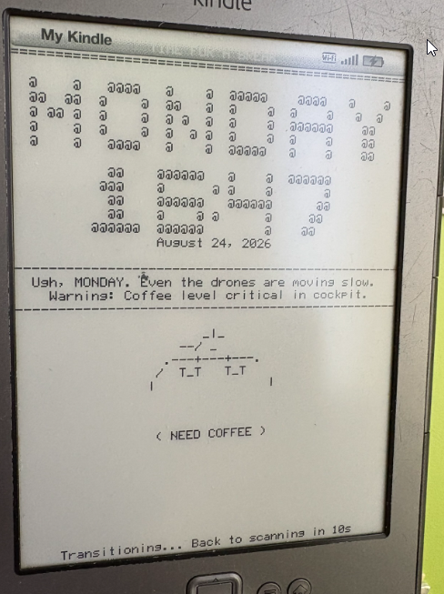

#### Radar Visualization
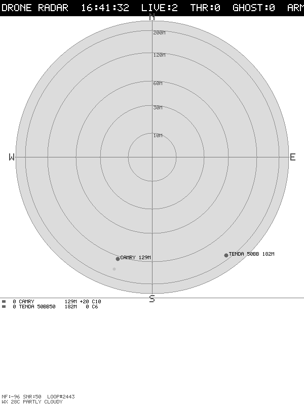


#### Graphical Radar Map
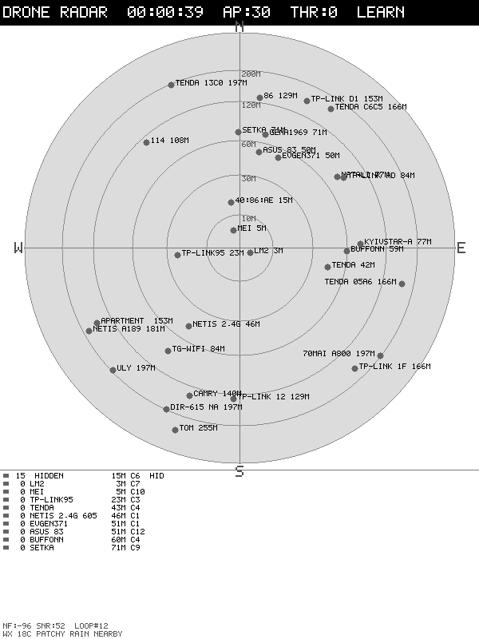

#### Message/Log Page


</details>

---

## Firewall Configuration

The app opens two ports for control and monitoring:

### Setup (automatic in drone-install-autostart.sh)
```bash
# Enable loopback access (for local button control)
iptables -A INPUT -i lo -j ACCEPT

# Enable external HTTP access on port 5555
iptables -A INPUT -i wlan0 -p tcp --dport 5555 -j ACCEPT
iptables -A INPUT -i wlan0 -p udp --dport 5555 -j ACCEPT

# Persist firewall rules
iptables-save > /etc/iptables/rules.v4
```

### Manual firewall management
```bash
# View current rules
iptables -L -n

# Reset to defaults (WARNING: disconnects SSH)
iptables -F
iptables -P INPUT ACCEPT
iptables -P FORWARD ACCEPT
iptables -P OUTPUT ACCEPT

# Restore from backup
iptables-restore < /mnt/us/iptables_backup.conf
```

<details>
<summary><strong>🖥️ Web UI Screenshots</strong></summary>

### Web UI Screenshots

#### Main Detection Dashboard
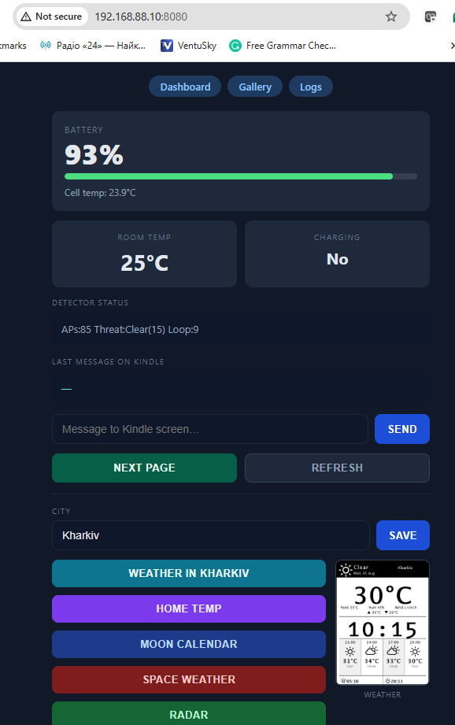

#### Detection Logs & History
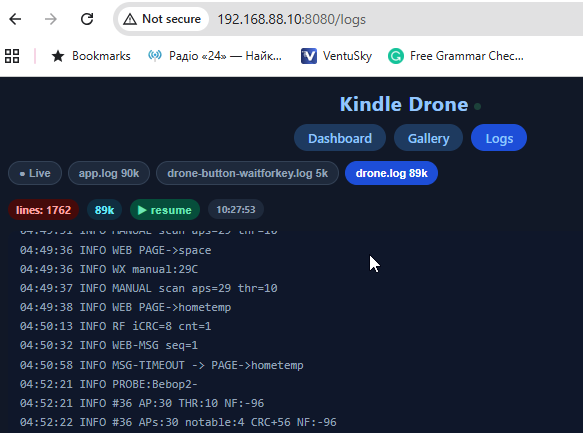

#### Gallery of All Pages
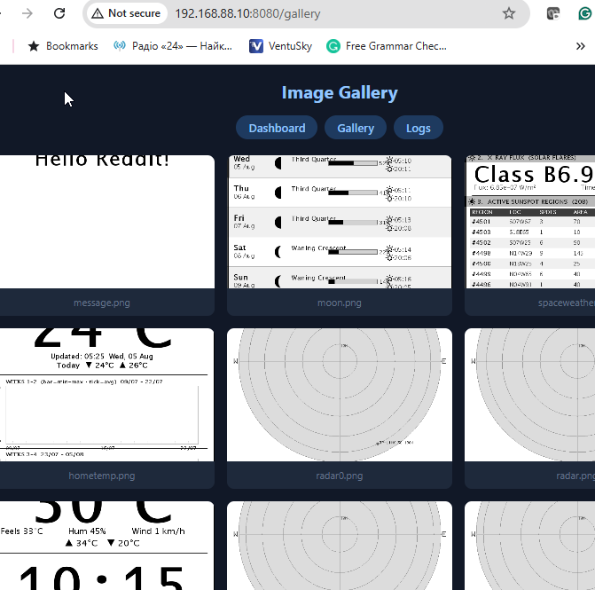

</details>

---

## Configuration & Tuning

### Main Application Properties
Edit `drone-app/src/main/resources/application.properties` before building:

```properties
# Scan interval (milliseconds)
detector.scan.interval=5000

# Threat score thresholds
detector.threat.alert=60
detector.threat.suspicious=30

# Distance model parameters
detector.distance.rssi.ref=-30
detector.distance.path.loss.exp=2.7

# Baseline learning period (scan cycles)
detector.baseline.loops=30

# CRC detection sensitivity
detector.crc.alert.threshold=200
detector.crc.idle.interval=10000

# E-ink refresh interval (milliseconds)
display.refresh.interval=5000
display.page.hold.ms=300000
```

### Temporal Analysis Tuning
- **Movement threshold (MOV):** RSSI standard deviation >10.0 dB
- **New device threshold (NEW):** Signal >−80 dBm  
- **Channel hop threshold (HOP):** Seen on 2+ channels
- **Transient threshold (TRN):** Peak signal >−80 dBm + 2+ gaps in history
- **Hidden range limit (HID):** <80 meters estimated distance
- **EMA smoothing factor (α):** 0.25 (τ≈20 seconds)

---

## Troubleshooting

### App won't start
```bash
# Check if port 5555 is in use
netstat -tlnp | grep 5555

# Check Java runtime
ls -la /mnt/us/java/jre/bin/java

# Check logs
cat /mnt/us/drone-app.log
```

### Screen shows only white
- Clear e-ink cache: `eips -c`
- Restart app: `/mnt/us/drone-control.sh restart`
- Check for "eips -f" calls in logs (known issue, fixed in v2.1)

### WiFi disconnects during scanning
- Run: `wmiconfig -i wlan0 --power maxperf` (reapplied every 2.5 min automatically)
- Check power management: `wmiconfig -i wlan0 --getpower`
- Reduce scan dwell time: `wmiconfig -i wlan0 --scan --pas=100` (default 200 ms)

### High CPU/Battery drain
- Increase scan interval: edit `detector.scan.interval=10000` (10 seconds)
- Disable radar display: comment out radar page rotation
- Enable power saving: `echo rec > /proc/sys/kernel/...` (reduces detection sensitivity)

### Firewall port access denied
- Add rule: `iptables -A INPUT -i wlan0 -p tcp --dport 5555 -j ACCEPT`
- Restart app: `/mnt/us/drone-control.sh restart`
- Verify: `iptables -L -n | grep 5555`

---

## Project Structure

```
drone/
├── README.md                           # This file
├── docs/
│   ├── DETECTION_SCORING.md           # Threat scoring algorithm
│   ├── CHIPSET_CAPABILITIES.md        # AR6003 firmware guide
│   ├── DISTANCE_CALCULATION.md        # RSSI path loss models
│   └── HARDWARE_SENSORS.md            # Kindle 4 I2C sensors
├── pom.xml                             # Parent Maven config
├── drone-util/                         # Shared utilities
├── drone-core/                         # Detection engine
├── drone-display/                      # E-ink rendering
├── drone-app/                          # Packaged JAR (main executable)
└── scripts/kindle/
    ├── drone-control.sh               # Control script (start/stop/status)
    ├── drone-start.sh                 # Idempotent startup
    ├── drone-install-autostart.sh     # Enable boot autostart
    └── drone-button-*.sh              # Hardware button integration
```

---

## Documentation

- **[DETECTION_SCORING.md](docs/DETECTION_SCORING.md)** — Threat scoring algorithm, temporal analysis flags
- **[CHIPSET_CAPABILITIES.md](docs/CHIPSET_CAPABILITIES.md)** — AR6003 firmware, wmiconfig commands, CRC analysis
- **[DISTANCE_CALCULATION.md](docs/DISTANCE_CALCULATION.md)** — RSSI path loss models, Java implementations
- **[HARDWARE_SENSORS.md](docs/HARDWARE_SENSORS.md)** — I2C devices, temperature/battery APIs
- **[DEPLOYMENT_GUIDE.md](docs/DEPLOYMENT_GUIDE.md)** — Production setup, firewall, logging, troubleshooting
- **[scripts/kindle/README.md](scripts/kindle/README.md)** — Runtime control scripts, button mapping

---

## Hardware Notes

### Kindle 4 Sensors (I2C bus 1)

| Address | Device | Type | Status | Access |
|---|---|---|---|---|
| 1-0048 | Papyrus PMIC | Temperature | ✅ Working | `/sys/bus/i2c/devices/1-0048/papyrus_temperature` |
| 1-0055 | Yoshi Battery | Fuel gauge | ✅ Working | `lipc-get-prop -i com.lab126.powerd battLevel` |
| 1-0035 | Maxim AL32 | Ambient light | ❌ No driver | Unreadable |
| 1-001a | WM8962 | Audio codec | ❌ No sensor | Not useful |
| 1-0006 | SMB347 | Charger | ❌ Not responding | See SMB347_INVESTIGATION.md |

### Known Issues

1. **Power mode resets** — Kindle daemon resets radio to "rec" every ~2.5 min. App re-applies `--power maxperf` every 30 loops.
2. **CRC errors during scanning** — Normal (30–100/interval). Non-WiFi RF >200 = interference, >500 = drone nearby.
3. **E-ink refresh overhead** — Minimize with diff-based updates; avoid `eips -f` after `eips -g`.
4. **Power bank auto-shutoff** — At 100% battery, charging current drops, power bank sees low load. App auto-throttles to ≤85%.

---

## Building from Source

### Prerequisites
- Java 8+ (Maven compatible)
- Maven 3.6+
- Bash/Git

### Compile on Development Machine
```bash
mvn clean compile
```

### Create JAR
```bash
mvn -DskipTests package
```

### Unit Tests (optional)
```bash
mvn test
```

### Cross-compile for Kindle (ARM)
Pre-built Kindle-compatible JAR is included in `drone-app/target/`. To rebuild for ARM:
```bash
# Use ARMv7 JDK or cross-compile toolchain
mvn -DskipTests -P arm package
```

---

## License

This project is provided as-is for educational and RF research purposes.

---

## Contributing

Contributions welcome! Please submit issues and pull requests via GitHub.

---

## Support & Resources

- **AR6003 Documentation:** Atheros datasheets (limited public availability)
- **Kindle Jailbreak:** MobileRead wiki (https://www.mobileread.com/)
- **E-ink Rendering:** eips tool documentation
- **RSSI Path Loss:** See DISTANCE_CALCULATION.md for academic references
